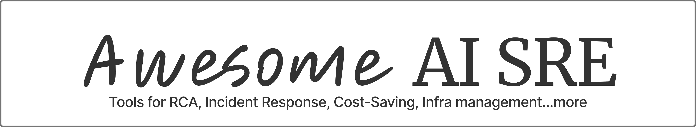
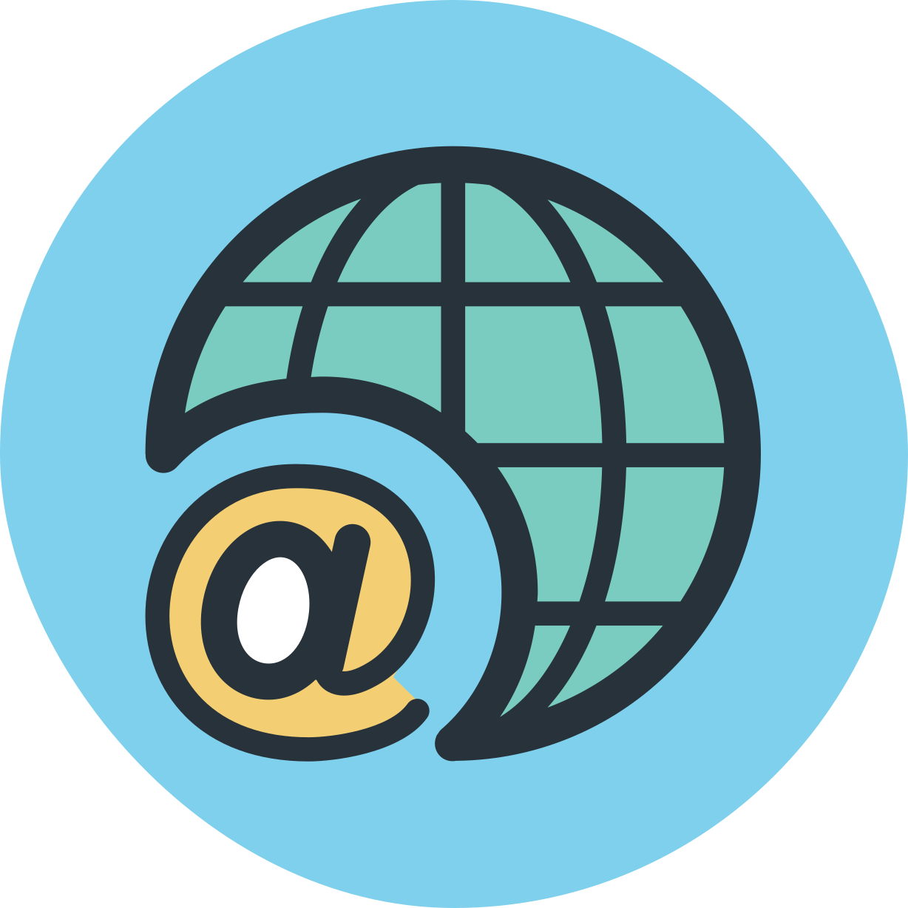

If this repository is useful, please consider starring :star: it.

## Tools

Items with :green_heart: indicate open source projects.

> AUTO-GENERATED FILE - DO NOT EDIT MANUALLY.
> Auto-generated by CI workflow or pre-commit hooks using `node generate-readme.js`.

Jump to: [Incident Response](#incident-response) | [Observability](#observability) | [Infrastructure](#infrastructure) | [Cost Optimization](#cost-optimization)

### Incident Response (29)

| Name | Summary | Deployment | Links |
| --- | --- | --- | --- |
| [AlertD](https://alertd.ai) | AlertD is an agentic AI teammate for SRE and DevOps on AWS, cutting alert noise and dashboard fatigue while delivering contextual answers and automated actions. | SaaS |   |
| [Azure SRE Agent](https://azure.microsoft.com/products/sre-agent) | AI-powered reliability assistant for Azure that automates incident response, root-cause analysis, and mitigation workflows. | SaaS |     |
| [Bacca.ai](https://www.bacca.ai) | Cut downtime with AI SRE Tool. Automate monitoring, pinpoint root causes, fix errors and optimize site performance. Try it now! | SaaS |   |
| [Beeps](https://beeps.ai/) | AI-powered operations assistant focused on helping teams handle alerts and incident workflows faster. | SaaS |   |
| [BigPanda](https://www.bigpanda.io) | AIOps platform for event correlation, incident detection, and response orchestration across modern IT operations. | SaaS |    |
| [Cleric](https://cleric.ai) | Cleric is an autonomous AI SRE that helps engineering teams quickly diagnose production issues in complex cloud-native environments. | SaaS |   |
| [Cutover](https://www.cutover.com) | Cutover&#x27;s cloud-hosted Collaborative Automation platform connects teams and technology, helping you manage disaster recovery, migration, and release. | SaaS |    |
| [FireHydrant](https://firehydrant.com) | All-in-one incident management software for modern teams. FireHydrant helps you plan, respond, and resolve faster with smart alerting, on-call scheduling, AI-powered. | SaaS |   |
| [Harness Incident Response](https://www.harness.io/blog/introducing-harness-incident-response) | Most incidents start with change—so why manage them in isolation? Learn how Harness Incident Response connects the dots between alerts, changes, and workflows, powered. | SaaS |     |
| [incident.io](https://incident.io) | incident.io is an all-in-one incident management platform unifying on-call scheduling, real-time incident response, and integrated status pages – helping teams resolve. | SaaS |   |
| [IncidentFox](https://www.incidentfox.ai) | AI incident response platform designed to help teams investigate and resolve operational issues. | SaaS |    |
| [Lens K8s IDE](https://lenshq.io/products/lens-k8s-ide) | Kubernetes IDE for cluster operations and troubleshooting with AI-assisted diagnostics via Lens Prism. | Hybrid |     |
| [Lightrun](https://lightrun.com) | Lightrun&#039;s AI SRE that handles alerts, prevent issues early with live runtime context during development, and resolve alerts in minutes with verified RCA. | SaaS |   |
| [NeuBird AI](https://neubird.ai) | NeuBird AI&#039;s agentic AI SRE delivers autonomous incident resolution, helping team cut MTTR up to 90% and reclaim engineering hours lost to troubleshooting. Get. | SaaS |   |
| [NOFire AI](https://www.nofire.ai) | NOFire handles alerts, flags risky changes, turns incidents and tribal knowledge into lasting reliability memory. | SaaS |   |
| [OpsCompanion](https://opscompanion.ai) | OpsCompanion is the AI-driven Operations Intelligence Engine that automates root cause analysis, resolves alerts, and unifies observability across your stack helping. | SaaS |   |
| [PagerDuty SRE Agent](https://www.pagerduty.com/platform/ai-agents/sre/) | Transform critical operations with PagerDuty&#039;s AI first Operations Platform. Harness agentic AI and automation to accelerate work and build resilience. | SaaS |     |
| [Phoebe](https://phoebe.ai) | The immune system for your software. AI agents that continuously investigate live data, diagnose emerging issues and generate preemptive fixes. | SaaS |   |
| [ProdRescue AI](https://www.prodrescueai.com) | Automates incident reports and evidence-backed RCA for SRE teams from Slack war rooms or logs in minutes. | SaaS |    |
| [Resolve AI](https://resolve.ai) | Resolve AI handles all alerts, performs root cause analysis, and troubleshoots incidents within minutes | SaaS |   |
| [RobinRelay](https://robinrelay.ai) | AI on-call copilot for Slack that cuts MTTR by 75%. Reduce alert noise, recall past incident fixes, and save thousands of engineering hours yearly. | SaaS |   |
| [Rootly](https://rootly.com) | The all-in-one incident management platform, including AI SRE agents—built for fast-moving engineering teams to detect, manage, learn from, and resolve incidents faster. | SaaS |   |
| [Scoutflo](https://scoutflo.com) | Your AI SRE for incident response and debugging. AI handles alerts, finds root causes, and fixes issues in minutes. | SaaS |   |
| [Sherlocks.ai](https://sherlocks.ai) | Cut MTTR by 10x with AI SREs that investigate incidents 24/7, automate root cause analysis, and prevent outages before they happen. Try Sherlocks.ai free. | SaaS |   |
| [Steadwing](https://www.steadwing.com) | Steadwing is an autonomous on-call engineer that finds root causes in under 5 minutes and fixes them. It correlates logs, metrics, traces, and code to deliver actionable RCAs and real remediation-PRs, rollbacks, config changes, and more-with 20+ integrations. | SaaS |     |
| [TierZero AI](https://www.tierzero.ai) | TierZero&#x27;s AI agents investigate incidents, triage alerts, and fix production problems automatically — so your engineers can ship faster. | SaaS |   |
| [Traversal](https://traversal.com) | Traversal cuts through alert noise, surfaces root causes, and guides your team to remediation — so incidents get fixed in minutes, not hours. | SaaS |   |
| [Vibranium Labs](https://vibraniumlabs.ai) | AI reliability tooling company focused on incident response automation and operations intelligence. | SaaS |   |
| [Wild Moose](https://www.wildmoose.ai) | Wild Moose helps developers solve production issues faster, kicking off any root cause investigation automatically. Triggered by alerts, the AI moose autonomously. | SaaS |   |

<a href="#tools">Back to top ↑</a>

### Observability (14)

| Name | Summary | Deployment | Links |
| --- | --- | --- | --- |
| [Better Stack](https://betterstack.com) | Observability and incident management platform with AI SRE, eBPF-based tracing, logs, metrics, uptime monitoring, and on-call workflows. | SaaS |   |
| [Causely](https://www.causely.ai) | Causely pinpoints the root cause of errors so that you can consistently meet reliability expectations of application users in complex, cloud native environments. | SaaS |   |
| [DagKnows, Inc](https://dagknows.ai) | AI operations company focused on improving incident diagnostics and reliability workflows. | SaaS |   |
| [Datadog (Bits AI)](https://www.datadoghq.com) | See metrics from all of your apps, tools & services in one place with Datadog’s cloud monitoring as a service solution. Try it for free. | SaaS |     |
| [Deductive AI](https://www.deductive.ai) | Deductive AI transforms your root-causing process by effortlessly understanding your entire codebase along with the telemetry data. | SaaS |   |
| [Deeptrace](https://deeptrace.com) | Automate and cut your on-call/debugging time in half with AI. | SaaS |   |
| [Edge Delta](https://www.edgedelta.com/) | Observability pipeline and AI analytics platform for processing telemetry at scale and accelerating incident investigation. | SaaS |   |
| [Elastic](https://www.elastic.co/observability) | Learn more about Elastic Observability. Elastic Observability resolves problems faster at reduced cost with an open source, AI-powered observability, that is accurate,. | SaaS |     |
| [Logz.io](https://logz.io) | Stop Chasing Alerts. Get Ahead of Problems with AI-Powered Observability. | SaaS |   |
| [Mezmo](https://www.mezmo.com) | Combine intelligent telemetry with AI-driven observability to detect issues, pinpoint root cause, and power agentic operations across logs, metrics, and traces. | SaaS |   |
| [Observe, Inc.](https://www.observeinc.com) | Observe is a modern observability platform built on a streaming data lake, for faster search and correlation at lower cost. | SaaS |   |
| [Sentry](https://sentry.io) | Application performance monitoring for developers &#38; software teams to see errors clearer, solve issues faster &#38; continue learning continuously. Get started at. | SaaS |    |
| [SIXTA](https://sixta.ai) | AI-powered root cause analysis for database reliability | SaaS |   |
| [SRE Bench](https://srebench.com/) | Evaluation and benchmarking platform for SRE agents and operational AI reliability workflows. | SaaS |   |

<a href="#tools">Back to top ↑</a>

### Infrastructure (21)

| Name | Summary | Deployment | Links |
| --- | --- | --- | --- |
| [Agent SRE](https://agentsre.ai) | AgentSRE is built for enterprises that can’t afford downtime. A fleet of AI agents automates detection, root cause analysis, and remediation - delivering faster recovery, lower cloud costs, and resilient operations | Hybrid |  |
| [AutonomOps AI](https://autonomops.ai) | Autonomous operations platform that applies AI to improve SRE and incident management workflows. | SaaS |   |
| [Ciroos](https://ciroos.ai) | Ciroos transforms SRE with AI-driven automation, reducing toil, detecting anomalies early, and accelerating incident investigations. | SaaS |   |
| [Cloudship AI](https://www.cloudshipai.com) | AI platform for cloud and platform engineering workflows focused on reliability and operations. | SaaS |   |
| [Cokpit](https://cokpit.ai) | Cokpit scales with your needs — from startups to global enterprises. | SaaS |    |
| :green_heart:[HolmesGPT](https://holmesgpt.dev) | Open source AI SRE agent that iteratively investigates incidents using data from your Kubernetes and observability stack. | Hybrid |     |
| :green_heart:[K8sGPT](https://k8sgpt.ai) | K8sGPT is an AI-powered tool that helps diagnose and fix Kubernetes issues with intelligent insights and automated troubleshooting. | Hybrid |    |
| :green_heart:[Kagent](https://kagent.dev) | Open-source Kubernetes-native framework for building and running AI agents that automate DevOps operations and troubleshooting tasks. | Hybrid |   |
| [Komodor](https://komodor.com) | Komodor automatically detects, investigates and remediates complex issues to proactively reduce cloud costs, slash MTTR and vanquish TicketOps. | SaaS |   |
| [Kura](https://www.usekura.com/) | AI platform for engineering operations and incident response automation in modern infrastructure environments. | SaaS |  |
| :green_heart:[Obot](https://github.com/obot-platform/obot) | Open source agent platform for creating, running, and integrating autonomous assistants across workflows. | Hybrid |   |
| [Ops0](https://www.ops0.com) | ops0 automates how infrastructure is created, managed, and operated. Turn intent into IaC, apply updates intelligently, and resolve issues before they happen all powered. | SaaS |    |
| [Opsy](https://opsy.sh) | AI-powered reliability operations platform for faster incident response and SRE workflow automation. | SaaS |   |
| [Rebase](https://rebase.run) | Every company needs to become an AI company. Rebase is the infrastructure to get there — connect all your systems, access any LLMs, and deploy AI agents across your. | SaaS |   |
| [Robusta Dev](https://home.robusta.dev) | Robusta's AI assistant empowers teams to troubleshoot Prometheus and Kubernetes alerts faster, leading to reduced MTTR and enhanced engineering productivity. | Multi |     |
| [RunLLM](https://www.runllm.com) | The AI SRE for mission-critical systems that delivers transparent investigations, evidence-backed root cause analysis, and continuous runbook improvement. | SaaS |   |
| [RunWhen](https://www.runwhen.com) | RunWhen is committed to simplifying troubleshooting for complex cloud systems with the help of AI powered Engineering Assistants capable of suggesting what to run, and. | SaaS |   |
| :green_heart:[Skyflo.ai](https://skyflo.ai) | Skyflo is an open-source AI agent for DevOps and cloud operations. It plans, executes, and verifies infrastructure changes across Kubernetes, CI/CD, and cloud platforms. | Hybrid |    |
| [SRE.ai](https://www.sre.ai) | SRE.ai is the most advanced natural language DevOps platform, powering automation and software delivery for fast-moving organizations at scale, freeing up teams to build. | SaaS |   |
| [StackGen](https://stackgen.com) | Autonomous infrastructure platform powered by Aiden for platform engineering, DevOps, and SRE teams to automate provisioning, governance, and operations. | Hybrid |   |
| [StarSling](https://www.starsling.dev) | Multi-agent automation platform that orchestrates AI workflows for operations, troubleshooting, and remediation. | SaaS |    |
| [Stakpak](https://www.stakpak.dev) | An open source agent that lives on your machines 24/7, keeps your apps running, and only pings when it needs a human. | SaaS |    |

<a href="#tools">Back to top ↑</a>

### Cost Optimization (2)

| Name | Summary | Deployment | Links |
| --- | --- | --- | --- |
| [Infrabase](https://infrabase.co) | Infrabase scans code and organizational context to surface security gaps, cost spikes, and policy breaks before they ever hit your cloud. | SaaS |  |
| [NudgeBee](https://www.nudgebee.com) | Agentic AI platform for SRE & CloudOps, troubleshooting, cost optimization, and no-code workflow automation. | SaaS |   |

<a href="#tools">Back to top ↑</a>

