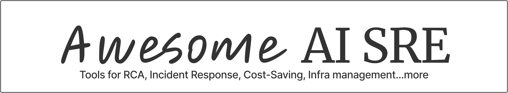

# Awesome AI SRE

A curated directory of AI-powered tools and practical resources for site reliability engineering, incident response, observability, and AIOps.

**[Explore the AI SRE Watchlist](https://aisrewatchlist.vercel.app)** for searchable profiles, filters, evidence, and evaluation guides.

[Browse tools](https://aisrewatchlist.vercel.app/tools) · [Read resources](https://aisrewatchlist.vercel.app/resources) · [See the methodology](https://aisrewatchlist.vercel.app/methodology) · [Get updates](https://aisrewatchlist.vercel.app/updates)

If this project is useful, please consider giving it a ⭐.

> This README is generated from the catalog and published resources in this repository. Edit the source files, then run `npm run generate:readme`.

## Tools

Browse all 80 tools on the **[Watchlist website](https://aisrewatchlist.vercel.app/tools)** for richer profiles and easier comparison. 💚 marks open-source projects.

### Recent additions (last 14 days)

- 2026-07-10 — [Oodle](https://aisrewatchlist.vercel.app/tools/oodle) (Observability)
- 2026-07-07 — [Metoro](https://aisrewatchlist.vercel.app/tools/metoro) (Observability)
- 2026-07-02 — 💚 [Aurora](https://aisrewatchlist.vercel.app/tools/aurora) (Incident Response)
- 2026-06-29 — [RubixKube](https://aisrewatchlist.vercel.app/tools/rubixkube) (Incident Response)

[Incident Response](#incident-response) · [Observability](#observability) · [AIOps](#aiops) · [IDP](#idp) · [IaC](#iac) · [Security](#security) · [Deployment](#deployment)

### Incident Response (33)

- [Agent SRE](https://aisrewatchlist.vercel.app/tools/agent-sre) — AgentSRE is built for enterprises that can't afford downtime. A fleet of AI agents automates detection, root cause analysis, and remediation - delivering faster recovery, lower cloud costs, and resilient operations. [Website](https://agentsre.ai)
- [AlertD](https://aisrewatchlist.vercel.app/tools/alertd) — AlertD is an agentic AI teammate for SRE and DevOps on AWS, cutting alert noise and dashboard fatigue while delivering contextual answers and automated actions. [Website](https://alertd.ai)
- 💚 [Aurora](https://aisrewatchlist.vercel.app/tools/aurora) — Open source AI SRE agent that autonomously investigates incidents and delivers root cause analysis across AWS, Azure, GCP, and Kubernetes. [Website](https://www.aurorasre.ai) · [GitHub](https://github.com/Arvo-AI/aurora)
- [AutonomOps AI](https://aisrewatchlist.vercel.app/tools/autonomops-ai) — Autonomous operations platform that applies AI to improve SRE and incident management workflows. [Website](https://autonomops.ai)
- [Azure SRE Agent](https://aisrewatchlist.vercel.app/tools/azure-sre-agent) — AI-powered reliability assistant for Azure that automates incident response, root-cause analysis, and mitigation workflows. [Website](https://azure.microsoft.com/products/sre-agent) · [GitHub](https://github.com/microsoft/sre-agent)
- [Bacca.ai](https://aisrewatchlist.vercel.app/tools/bacca-ai) — AI SRE for high-scale platforms that uses tribal knowledge to triage and mitigate incidents accurately. [Website](https://www.bacca.ai)
- [Beeps](https://aisrewatchlist.vercel.app/tools/beeps) — AI-powered operations assistant focused on helping teams handle alerts and incident workflows faster. [Website](https://beeps.ai/)
- [Cleric](https://aisrewatchlist.vercel.app/tools/cleric) — Cleric is a self-learning AI SRE that autonomously investigates production alerts and returns evidence-linked findings in Slack. It builds operational memory from prior investigations and engineer feedback while integrating with existing observability, CI/CD, and incident tooling. [Website](https://cleric.ai/)
- [DrDroid](https://aisrewatchlist.vercel.app/tools/drdroid) — AI that understands your production system, infrastructure, applications, and business context to investigate incidents and explain root causes. [Website](https://drdroid.io) · [GitHub](https://github.com/DrDroidLab)
- [FireHydrant](https://aisrewatchlist.vercel.app/tools/firehydrant) — All-in-one incident management software for modern teams. FireHydrant helps you plan, respond, and resolve faster with smart alerting, on-call scheduling, AI-powered. [Website](https://firehydrant.com)
- [Harness AI-SRE](https://aisrewatchlist.vercel.app/tools/harness-ai-sre) — Most incidents start with change—so why manage them in isolation? Learn how Harness AI-SRE connects the dots between alerts, changes, and workflows, powered. [Website](https://www.harness.io/products/ai-sre) · [GitHub](https://github.com/harness)
- [incident.io Investigations](https://aisrewatchlist.vercel.app/tools/incident-io) — Investigations is an AI capability inside incident.io's hosted incident-management platform, not a separate standalone agent. It starts from alerts and combines telemetry, code changes, past incidents, and Slack context to surface likely causes and recommended next steps. [Website](https://incident.io/investigations)
- [IncidentFox](https://aisrewatchlist.vercel.app/tools/incidentfox) — AI incident response platform designed to help teams investigate and resolve operational issues. [Website](https://www.incidentfox.ai) · [GitHub](https://github.com/incidentfox/incidentfox)
- [NeuBird AI](https://aisrewatchlist.vercel.app/tools/neubird-ai) — NeuBird AI's agentic AI SRE delivers autonomous incident resolution, helping teams cut MTTR by up to 90% and reclaim engineering hours lost to troubleshooting. [Website](https://neubird.ai)
- [NOFire AI](https://aisrewatchlist.vercel.app/tools/nofire-ai) — NOFire handles alerts, flags risky changes, turns incidents and tribal knowledge into lasting reliability memory. [Website](https://www.nofire.ai)
- [OpsCompanion](https://aisrewatchlist.vercel.app/tools/opscompanion) — OpsCompanion is the AI-driven Operations Intelligence Engine that automates root cause analysis, resolves alerts, and unifies observability across your stack helping. [Website](https://opscompanion.ai)
- [PagerDuty SRE Agent](https://aisrewatchlist.vercel.app/tools/pagerduty) — Transform critical operations with PagerDuty&#039;s AI first Operations Platform. Harness agentic AI and automation to accelerate work and build resilience. [Website](https://www.pagerduty.com/platform/ai-agents/sre/) · [GitHub](https://github.com/PagerDuty)
- [Phoebe](https://aisrewatchlist.vercel.app/tools/phoebe) — The immune system for your software. AI agents that continuously investigate live data, diagnose emerging issues and generate preemptive fixes. [Website](https://phoebe.ai)
- [ProdRescue AI](https://aisrewatchlist.vercel.app/tools/prodrescue-ai) — Automates incident reports and evidence-backed RCA for SRE teams from Slack war rooms or logs in minutes. [Website](https://www.prodrescueai.com)
- [Resolve AI](https://aisrewatchlist.vercel.app/tools/resolve-ai) — Resolve AI is a production-operations platform with agents for on-call triage, incident investigation, and recurring operational work. Its agents work across code, infrastructure, telemetry, and knowledge using evidence-based, multi-agent investigations. [Website](https://resolve.ai/product/overview)
- [RobinRelay](https://aisrewatchlist.vercel.app/tools/robinrelay) — AI on-call copilot for Slack that cuts MTTR by 75%. Reduce alert noise, recall past incident fixes, and save thousands of engineering hours yearly. [Website](https://robinrelay.ai)
- [Rootly](https://aisrewatchlist.vercel.app/tools/rootly) — The all-in-one incident management platform, including AI SRE agents—built for fast-moving engineering teams to detect, manage, learn from, and resolve incidents faster. [Website](https://rootly.com)
- [RubixKube](https://aisrewatchlist.vercel.app/tools/rubixkube) — AI-native Site Reliability Intelligence platform that helps engineering teams protect revenue, customer trust, and engineering focus by detecting infrastructure failures, risky deployments, and slowdowns before they become customer-impacting incidents. [Website](https://rubixkube.ai) · [GitHub](https://github.com/rubixkube-io)
- [RunLLM](https://aisrewatchlist.vercel.app/tools/runllm) — The AI SRE for mission-critical systems that delivers transparent investigations, evidence-backed root cause analysis, and continuous runbook improvement. [Website](https://www.runllm.com)
- [Scoutflo](https://aisrewatchlist.vercel.app/tools/scoutflo) — Your AI SRE for incident response and debugging. AI handles alerts, finds root causes, and fixes issues in minutes. [Website](https://scoutflo.com)
- [Sherlocks.ai](https://aisrewatchlist.vercel.app/tools/sherlocks-ai) — Cut MTTR by 10x with AI SREs that investigate incidents 24/7, automate root cause analysis, and prevent outages before they happen. Try Sherlocks.ai free. [Website](https://sherlocks.ai)
- [Steadwing](https://aisrewatchlist.vercel.app/tools/steadwing) — Steadwing is an autonomous on-call engineer that finds root causes in under 5 minutes and fixes them. It correlates logs, metrics, traces, and code to deliver actionable RCAs and real remediation-PRs, rollbacks, config changes, and more-with 20+ integrations. [Website](https://www.steadwing.com)
- [TierZero AI](https://aisrewatchlist.vercel.app/tools/tierzero-ai) — TierZero's AI agents investigate incidents, triage alerts, and fix production problems automatically — so your engineers can ship faster. [Website](https://www.tierzero.ai)
- 💚 [Tracer](https://aisrewatchlist.vercel.app/tools/tracer-cloud) — OS-level AI SRE platform for high-compute workloads that accelerates alert investigation, root-cause analysis, and mitigation inside your environment. [Website](https://www.tracer.cloud) · [GitHub](https://github.com/Tracer-Cloud/open-sre-agent)
- [Traversal](https://aisrewatchlist.vercel.app/tools/traversal) — Traversal is an enterprise AI SRE platform for automated alert triage, incident investigation, root-cause analysis, and remediation. Its agents combine causal machine learning with production telemetry and support read-only access and flexible on-premise deployments. [Website](https://www.traversal.com/)
- [Vibranium Labs](https://aisrewatchlist.vercel.app/tools/vibranium-labs) — AI reliability tooling company focused on incident response automation and operations intelligence. [Website](https://vibraniumlabs.ai)
- [Vigiles](https://aisrewatchlist.vercel.app/tools/vigiles) — Incident management platform for modern teams with outage detection, on-call alerting, response coordination, status pages, and AI postmortems. [Website](https://vigileshq.com)
- [Wild Moose](https://aisrewatchlist.vercel.app/tools/wild-moose) — Wild Moose helps developers solve production issues faster, kicking off any root cause investigation automatically. Triggered by alerts, the AI moose autonomously. [Website](https://www.wildmoose.ai)

### Observability (17)

- [Agent0 by Dash0](https://aisrewatchlist.vercel.app/tools/agent0-by-dash0) — Agent0 is Dash0's production AI built into its OpenTelemetry-native hosted observability platform. It surfaces production issues, investigates telemetry and code, and creates validated artifacts such as dashboards, alerts, and pull-request drafts. [Website](https://www.dash0.com/agent0) · [GitHub](https://github.com/dash0hq)
- [Better Stack AI SRE](https://aisrewatchlist.vercel.app/tools/better-stack) — Better Stack AI SRE is a chat-based assistant within Better Stack's hosted observability and incident-management platform, rather than a separate standalone agent. It investigates using Better Stack telemetry and connected tools, while write actions require human approval. [Website](https://betterstack.com/ai-sre) · [GitHub](https://github.com/BetterStackHQ)
- [Causely](https://aisrewatchlist.vercel.app/tools/causely) — Causely pinpoints the root cause of errors so that you can consistently meet reliability expectations of application users in complex, cloud native environments. [Website](https://www.causely.ai)
- [DagKnows, Inc](https://aisrewatchlist.vercel.app/tools/dagknows-inc) — AI operations company focused on improving incident diagnostics and reliability workflows. [Website](https://dagknows.ai)
- [Datadog (Bits AI)](https://aisrewatchlist.vercel.app/tools/datadog-bits-ai) — See metrics from all of your apps, tools & services in one place with Datadog’s cloud monitoring as a service solution. Try it for free. [Website](https://www.datadoghq.com) · [GitHub](https://github.com/DataDog)
- [Deductive AI](https://aisrewatchlist.vercel.app/tools/deductive-ai) — Deductive AI transforms your root-causing process by effortlessly understanding your entire codebase along with the telemetry data. [Website](https://www.deductive.ai)
- [Deeptrace](https://aisrewatchlist.vercel.app/tools/deeptrace) — Automate and cut your on-call/debugging time in half with AI. [Website](https://deeptrace.com)
- [Edge Delta](https://aisrewatchlist.vercel.app/tools/edge-delta) — Observability pipeline and AI analytics platform for processing telemetry at scale and accelerating incident investigation. [Website](https://www.edgedelta.com/)
- [Elastic](https://aisrewatchlist.vercel.app/tools/elastic) — Learn more about Elastic Observability. Elastic Observability resolves problems faster at reduced cost with an open source, AI-powered observability, that is accurate,. [Website](https://www.elastic.co/observability) · [GitHub](https://github.com/elastic)
- [Lightrun](https://aisrewatchlist.vercel.app/tools/lightrun) — Lightrun describes an AI SRE workflow for handling alerts and using live runtime context during development. [Website](https://lightrun.com)
- [Logz.io](https://aisrewatchlist.vercel.app/tools/logz-io) — Stop Chasing Alerts. Get Ahead of Problems with AI-Powered Observability. [Website](https://logz.io)
- [Metoro](https://aisrewatchlist.vercel.app/tools/metoro) — Metoro is an AI SRE and Kubernetes observability platform that collects telemetry with eBPF and uses AI agents to detect production issues, investigate alerts, verify deployments, identify root causes, and generate fix PRs. [Website](https://metoro.io) · [GitHub](https://github.com/metoro-io)
- [Mezmo](https://aisrewatchlist.vercel.app/tools/mezmo) — Combine intelligent telemetry with AI-driven observability to detect issues, pinpoint root cause, and power agentic operations across logs, metrics, and traces. [Website](https://www.mezmo.com)
- [Observe, Inc.](https://aisrewatchlist.vercel.app/tools/observe-inc) — Observe is a modern observability platform built on a streaming data lake, for faster search and correlation at lower cost. [Website](https://www.observeinc.com)
- [Oodle](https://aisrewatchlist.vercel.app/tools/oodle) — Oodle is a unified observability platform with an AI assistant that investigates alerts across metrics, logs, traces, and events. It can run as managed SaaS, with customer-owned object storage, or in a customer cluster. [Website](https://www.oodle.ai/product/agent-driven-debugging) · [GitHub](https://github.com/oodle-ai)
- [Sentry](https://aisrewatchlist.vercel.app/tools/sentry) — Application performance monitoring for developers and software teams to see errors more clearly, solve issues faster, and improve reliability continuously. [Website](https://sentry.io) · [GitHub](https://github.com/getsentry)
- [SIXTA](https://aisrewatchlist.vercel.app/tools/sixta) — AI-powered root cause analysis for database reliability [Website](https://sixta.ai)

### AIOps (22)

- [BigPanda](https://aisrewatchlist.vercel.app/tools/bigpanda) — AIOps platform for event correlation, incident detection, and response orchestration across modern IT operations. [Website](https://www.bigpanda.io)
- [Ciroos](https://aisrewatchlist.vercel.app/tools/ciroos) — Ciroos transforms SRE with AI-driven automation, reducing toil, detecting anomalies early, and accelerating incident investigations. [Website](https://ciroos.ai)
- [Cloudship AI](https://aisrewatchlist.vercel.app/tools/cloudship-ai) — AI platform for cloud and platform engineering workflows focused on reliability and operations. [Website](https://www.cloudshipai.com)
- [Cokpit](https://aisrewatchlist.vercel.app/tools/cokpit) — Cokpit scales with your needs — from startups to global enterprises. [Website](https://cokpit.ai)
- 💚 [HolmesGPT](https://aisrewatchlist.vercel.app/tools/holmesgpt) — HolmesGPT is a CNCF Sandbox open-source SRE agent for investigating production incidents across Kubernetes, virtual machines, cloud services, databases, and other infrastructure. It can run as a CLI, HTTP server, or Kubernetes deployment and connects to operational systems through built-in toolsets. [Website](https://holmesgpt.dev/) · [GitHub](https://github.com/HolmesGPT/holmesgpt)
- [Hyground](https://aisrewatchlist.vercel.app/tools/hyground) — Self-hosted AI SRE agent that integrates into your infrastructure for fast incident analysis and reduced manual toil. [Website](https://hyground.ai)
- 💚 [Ingero](https://aisrewatchlist.vercel.app/tools/ingero) — Open-source eBPF agent and MCP server for GPU causal observability, helping LLM SRE agents investigate GPU stalls and map them back to Linux kernel events and CUDA call sites. [Website](https://ingero.io) · [GitHub](https://github.com/ingero-io/ingero)
- 💚 [K8sGPT](https://aisrewatchlist.vercel.app/tools/k8sgpt) — K8sGPT is an AI-powered tool that helps diagnose and fix Kubernetes issues with intelligent insights and automated troubleshooting. [Website](https://k8sgpt.ai) · [GitHub](https://github.com/k8sgpt-ai/k8sgpt)
- 💚 [Kagent](https://aisrewatchlist.vercel.app/tools/kagent) — Open-source Kubernetes-native framework for building and running AI agents that automate DevOps operations and troubleshooting tasks. [Website](https://kagent.dev) · [GitHub](https://github.com/kagent-dev/kagent)
- [KnoxOps](https://aisrewatchlist.vercel.app/tools/knoxops) — AI-native ops agent for SREs — gives agents production execution power with safety guardrails, human-in-the-loop review, and a built-in knowledge graph of your infrastructure. [Website](https://knoxops.app/)
- [Komodor](https://aisrewatchlist.vercel.app/tools/komodor) — Komodor automatically detects, investigates and remediates complex issues to proactively reduce cloud costs, slash MTTR and vanquish TicketOps. [Website](https://komodor.com)
- 💚 [KubeStellar Console](https://aisrewatchlist.vercel.app/tools/kubestellar-console) — Open-source multi-cluster Kubernetes dashboard with AI-powered operations via an MCP server that bridges kubeconfig contexts to LLM agents. [Website](https://console.kubestellar.io) · [GitHub](https://github.com/kubestellar/console)
- [Kura](https://aisrewatchlist.vercel.app/tools/kura) — AI platform for engineering operations and incident response automation in modern infrastructure environments. [Website](https://www.usekura.com/)
- [NudgeBee](https://aisrewatchlist.vercel.app/tools/nudgebee) — Agentic AI platform for SRE & CloudOps, troubleshooting, cost optimization, and no-code workflow automation. [Website](https://www.nudgebee.com)
- 💚 [Obot](https://aisrewatchlist.vercel.app/tools/obot) — Open source agent platform for creating, running, and integrating autonomous assistants across workflows. [Website](https://github.com/obot-platform/obot) · [GitHub](https://github.com/obot-platform/obot)
- [Opsy](https://aisrewatchlist.vercel.app/tools/opsy) — AI-powered reliability operations platform for faster incident response and SRE workflow automation. [Website](https://opsy.sh) · [GitHub](https://github.com/opsyhq/claw)
- [Robusta Dev](https://aisrewatchlist.vercel.app/tools/robusta) — Robusta's AI assistant empowers teams to troubleshoot Prometheus and Kubernetes alerts faster, leading to reduced MTTR and enhanced engineering productivity. [Website](https://home.robusta.dev) · [GitHub](https://github.com/robusta-dev/robusta)
- [RunWhen](https://aisrewatchlist.vercel.app/tools/runwhen) — RunWhen is an AI SRE platform whose foreground and background agents select and run diagnostic automation inside connected environments, then return evidence-backed findings and remediation guidance. It supports hosted, hybrid, and self-hosted deployments. [Website](https://www.runwhen.com) · [GitHub](https://github.com/runwhen-contrib)
- [SRE Bench](https://aisrewatchlist.vercel.app/tools/sre-bench) — Evaluation and benchmarking platform for SRE agents and operational AI reliability workflows. [Website](https://srebench.com/)
- [SRE.ai](https://aisrewatchlist.vercel.app/tools/sre-ai) — SRE.ai is the most advanced natural language DevOps platform, powering automation and software delivery for fast-moving organizations at scale, freeing up teams to build. [Website](https://www.sre.ai)
- 💚 [Stakpak](https://aisrewatchlist.vercel.app/tools/stakpak) — An open source agent that lives on your machines 24/7, keeps your apps running, and only pings when it needs a human. [Website](https://www.stakpak.dev) · [GitHub](https://github.com/stakpak/agent)
- [StarSling](https://aisrewatchlist.vercel.app/tools/starsling) — Multi-agent automation platform that orchestrates AI workflows for operations, troubleshooting, and remediation. [Website](https://www.starsling.dev)

### IDP (2)

- [Rebase](https://aisrewatchlist.vercel.app/tools/rebase) — Every company needs to become an AI company. Rebase is the infrastructure to get there — connect all your systems, access any LLMs, and deploy AI agents across your. [Website](https://rebase.run)
- [StackGen](https://aisrewatchlist.vercel.app/tools/stackgen) — Autonomous infrastructure platform powered by Aiden for platform engineering, DevOps, and SRE teams to automate provisioning, governance, and operations. [Website](https://stackgen.com)

### IaC (1)

- [Ops0](https://aisrewatchlist.vercel.app/tools/ops0) — ops0 automates how infrastructure is created, managed, and operated. Turn intent into IaC, apply updates intelligently, and resolve issues before they happen all powered. [Website](https://www.ops0.com)

### Security (2)

- [Cloudgeni](https://aisrewatchlist.vercel.app/tools/cloudgeni) — AI-powered cloud infrastructure platform that detects misconfigurations, remediates security and compliance issues, and generates reviewable infrastructure changes through deterministic workflows. [Website](https://cloudgeni.ai)
- [Infrabase](https://aisrewatchlist.vercel.app/tools/infrabase) — Infrabase scans code and organizational context to surface security gaps, cost spikes, and policy breaks before they ever hit your cloud. [Website](https://infrabase.co)

### Deployment (3)

- [Cutover](https://aisrewatchlist.vercel.app/tools/cutover) — Cutover's cloud-hosted Collaborative Automation platform connects teams and technology, helping you manage disaster recovery, migration, and release. [Website](https://www.cutover.com)
- [Lens K8s IDE](https://aisrewatchlist.vercel.app/tools/lens-k8s-ide) — Kubernetes IDE for cluster operations and troubleshooting with AI-assisted diagnostics via Lens Prism. [Website](https://lenshq.io/products/lens-k8s-ide) · [GitHub](https://github.com/lensapp/lens)
- 💚 [Skyflo.ai](https://aisrewatchlist.vercel.app/tools/skyflo-ai) — Skyflo is an open-source AI agent for DevOps and cloud operations. It plans, executes, and verifies infrastructure changes across Kubernetes, CI/CD, and cloud platforms. [Website](https://skyflo.ai) · [GitHub](https://github.com/skyflo-ai)

## Resources

Practical, evidence-led material for evaluating AI SRE products. **[Browse the full resource library](https://aisrewatchlist.vercel.app/resources)**.

- [AI SRE pilot scorecard](https://aisrewatchlist.vercel.app/resources/ai-sre-pilot-scorecard) — A practical scorecard for defining and reviewing an AI incident-response pilot.
- [AI SRE security and data-access checklist](https://aisrewatchlist.vercel.app/resources/ai-sre-security-data-access-checklist) — Questions for reviewing the access, data flow, model use, and action boundaries of an AI SRE product.
- [Managed vs self-hosted AI SRE architecture](https://aisrewatchlist.vercel.app/resources/managed-vs-self-hosted-ai-sre-architecture) — An architecture guide for comparing responsibility, data boundaries, and operating cost.
- [Map AI SRE products to the incident workflow](https://aisrewatchlist.vercel.app/resources/ai-sre-incident-workflow-map) — A guide to separating detection, triage, investigation, remediation, coordination, and learning claims.
- [Replay historical incidents safely](https://aisrewatchlist.vercel.app/resources/replay-historical-incidents-safely) — A draft method for evaluating incident-investigation tools without granting uncontrolled production action.
- [State of AI SRE 2026: baseline and research method](https://aisrewatchlist.vercel.app/resources/state-of-ai-sre-2026) — A planned evidence-led report on the incident-response capabilities, deployment models, and evaluation needs in the market.

## Contributing

Suggestions and corrections are welcome. [Open an issue](https://github.com/pavangudiwada/awesome-ai-sre/issues/new/choose) or add a tool record under `tools/operate/`; catalog changes are reviewed before publication.

The GitHub list is a quick overview. **[Visit AI SRE Watchlist](https://aisrewatchlist.vercel.app)** for the complete browsing and evaluation experience.

## License

[MIT](LICENSE)
