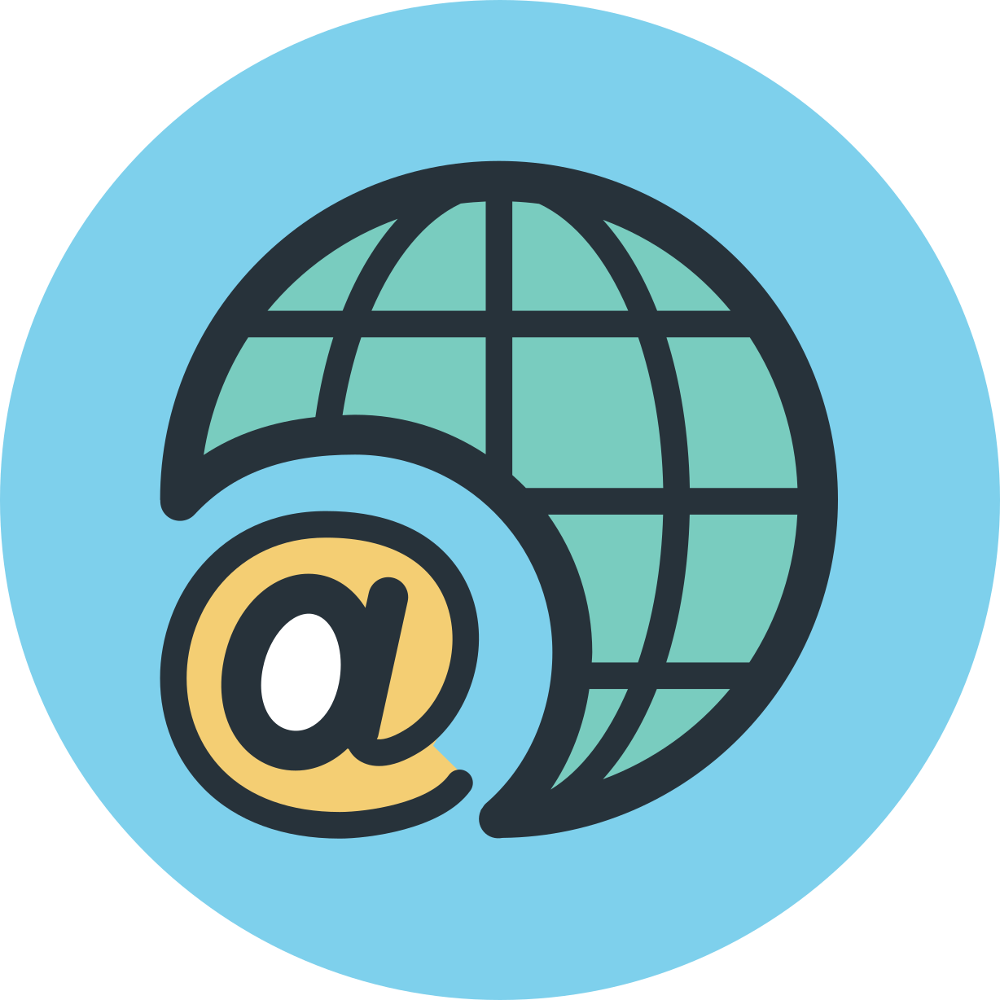

If this repository is useful, please consider starring :star: it.

## Tools

Items with :green_heart: indicate open source projects.

> AUTO-GENERATED FILE - DO NOT EDIT MANUALLY.
> Auto-generated by CI workflow or pre-commit hooks using `node generate-readme.js`.

### Recent Additions (Last 7 Days)

- 2026-09-22 - [Corelayer](https://www.corelayer.com/) (Incident Response)
- 2026-09-22 - :green_heart:[Darkmoon](https://dark-moon.org/) (Security)
- 2026-09-22 - :green_heart:[kprompt](https://kprompt.ai/) (AIOps)

Jump to: [Incident Response](#incident-response) | [Observability](#observability) | [AIOps](#aiops) | [IDP](#idp) | [IaC](#iac) | [Security](#security) | [Deployment](#deployment)

### Incident Response (32)

| Name | Summary | Deployment | Links |
| --- | --- | --- | --- |
| [AlertD](https://alertd.ai) | AlertD is an agentic AI teammate for SRE and DevOps on AWS, cutting alert noise and dashboard fatigue while delivering contextual answers and automated actions. | SaaS |   |
| :green_heart:[Aurora](https://www.aurorasre.ai) | Open source AI SRE agent that autonomously investigates incidents and delivers root cause analysis across AWS, Azure, GCP, and Kubernetes. | On-Prem |    |
| [AutonomOps AI](https://autonomops.ai) | Autonomous operations platform that applies AI to improve SRE and incident management workflows. | SaaS |   |
| [Azure SRE Agent](https://azure.microsoft.com/products/sre-agent) | AI-powered reliability assistant for Azure that automates incident response, root-cause analysis, and mitigation workflows. | SaaS |     |
| [Bacca.ai](https://www.bacca.ai) | AI SRE for high-scale platforms that uses tribal knowledge to triage and mitigate incidents accurately. | SaaS |   |
| [Beeps](https://beeps.ai/) | AI-powered operations assistant focused on helping teams handle alerts and incident workflows faster. | SaaS |   |
| [Cleric](https://cleric.ai/) | Cleric is a self-learning AI SRE that autonomously investigates production alerts and returns evidence-linked findings in Slack. It builds operational memory from prior investigations and engineer feedback while integrating with existing observability, CI/CD, and incident tooling. | SaaS |    |
| [Corelayer](https://www.corelayer.com/) | Corelayer is an AI SRE platform for production incident investigation and prevention. It connects code, deployments, infrastructure, telemetry, and operational context so teams can investigate failures across the full production stack. | Multi |  |
| [DrDroid](https://drdroid.io) | AI that understands your production system, infrastructure, applications, and business context to investigate incidents and explain root causes. | SaaS |     |
| [FireHydrant](https://firehydrant.com) | FireHydrant is an incident management platform for planning, responding to, and learning from incidents, with on-call, alerting, collaboration, and AI-assisted workflows. | SaaS |   |
| [Harness AI-SRE](https://www.harness.io/products/ai-sre) | Harness AI SRE connects alerts with deployments, feature flags, infrastructure changes, and monitoring signals to help teams investigate, document, and remediate incidents. | SaaS |     |
| [incident.io Investigations](https://incident.io/investigations) | Investigations is an AI capability inside incident.io's hosted incident-management platform, not a separate standalone agent. It starts from alerts and combines telemetry, code changes, past incidents, and Slack context to surface likely causes and recommended next steps. | SaaS |    |
| [IncidentFox](https://www.incidentfox.ai) | IncidentFox is an AI incident investigator that learns a team's systems and past incidents, investigates alerts, and prepares fixes for human approval. | SaaS |    |
| [NeuBird AI](https://neubird.ai) | NeuBird is an agentic reliability platform that queries telemetry in place, remembers investigation conclusions, and serves engineers and their agents through governed, policy-controlled interfaces. | SaaS |   |
| [NOFire AI](https://www.nofire.ai) | NOFire handles alerts, flags risky changes, turns incidents and tribal knowledge into lasting reliability memory. | SaaS |   |
| [PagerDuty SRE Agent](https://www.pagerduty.com/platform/ai-agents/sre/) | Transform critical operations with PagerDuty&#039;s AI first Operations Platform. Harness agentic AI and automation to accelerate work and build resilience. | SaaS |     |
| [Phoebe](https://phoebe.ai) | The immune system for your software. AI agents that continuously investigate live data, diagnose emerging issues and generate preemptive fixes. | SaaS |   |
| [ProdRescue AI](https://www.prodrescueai.com) | Automates incident reports and evidence-backed RCA for SRE teams from Slack war rooms or logs in minutes. | SaaS |    |
| [Resolve AI](https://resolve.ai/product/overview) | Resolve AI is a production-operations platform with agents for on-call triage, incident investigation, and recurring operational work. Its agents work across code, infrastructure, telemetry, and knowledge using evidence-based, multi-agent investigations. | Multi |    |
| [RobinRelay](https://robinrelay.ai) | RobinRelay is a Slack-native AI on-call copilot that monitors alert channels, adds context from past investigations and fixes, and answers questions about incident history. | SaaS |   |
| [Rootly](https://rootly.com) | The all-in-one incident management platform, including AI SRE agents—built for fast-moving engineering teams to detect, manage, learn from, and resolve incidents faster. | SaaS |   |
| [RubixKube](https://rubixkube.ai) | RubixKube is a Site Reliability Intelligence platform for detecting anomalies, diagnosing root causes, and resolving infrastructure failures. Its platform builds persistent context from operational signals and incident investigations. | Multi |    |
| [RunLLM](https://www.runllm.com) | The AI SRE for mission-critical systems that delivers transparent investigations, evidence-backed root cause analysis, and continuous runbook improvement. | SaaS |   |
| [Scoutflo](https://scoutflo.com) | Scoutflo is an AI SRE platform for Kubernetes and cloud-native teams. It helps investigate alerts, identify likely root causes, and turn resolved incidents into reusable playbooks. | SaaS |   |
| [Sherlocks.ai](https://sherlocks.ai) | Sherlocks AI is an AI SRE teammate that investigates incidents across connected data sources and reports root cause findings with the command output and evidence behind them. | SaaS |   |
| [Steadwing](https://www.steadwing.com) | Steadwing is an autonomous on-call engineer that correlates evidence across a team's stack, produces actionable root cause analyses, and prepares or performs approved remediation. | SaaS |     |
| [TierZero AI](https://www.tierzero.ai) | TierZero's AI agents investigate incidents, triage alerts, and fix production problems automatically — so your engineers can ship faster. | SaaS |   |
| :green_heart:[Tracer](https://www.tracer.cloud) | OS-level AI SRE platform for high-compute workloads that accelerates alert investigation, root-cause analysis, and mitigation inside your environment. | On-Prem |   |
| [Traversal](https://www.traversal.com/) | Traversal is an enterprise AI SRE platform for automated alert triage, incident investigation, root-cause analysis, and remediation. Its agents combine causal machine learning with production telemetry and support read-only access and flexible on-premise deployments. | On-Prem |    |
| [Vibranium Labs](https://vibraniumlabs.ai) | Vibranium Labs develops Vibe OnCall, an incident-response platform with AI agents for paging, triage, root-cause investigation, remediation, and incident knowledge capture. | SaaS |   |
| [Vigiles](https://vigileshq.com) | Incident management platform for modern teams with outage detection, on-call alerting, response coordination, status pages, and AI postmortems. | SaaS |  |
| [Wild Moose](https://www.wildmoose.ai) | Wild Moose is an always-on AI first responder that gathers context from fragmented observability tools and produces evidence-backed root cause summaries and recommended next actions. | SaaS |   |

<a href="#tools">Back to top ↑</a>

### Observability (17)

| Name | Summary | Deployment | Links |
| --- | --- | --- | --- |
| [Agent0 by Dash0](https://www.dash0.com/agent0) | Agent0 is Dash0's production AI built into its OpenTelemetry-native hosted observability platform. It surfaces production issues, investigates telemetry and code, and creates validated artifacts such as dashboards, alerts, and pull-request drafts. | SaaS |     |
| [Better Stack AI SRE](https://betterstack.com/ai-sre) | Better Stack AI SRE is a chat-based assistant within Better Stack's hosted observability and incident-management platform, rather than a separate standalone agent. It investigates using Better Stack telemetry and connected tools, while write actions require human approval. | SaaS |     |
| [Causely](https://www.causely.ai) | Causely maintains a causal model of distributed systems so engineers and software agents can trace symptoms to likely root causes and act on remediation context through its product and MCP server. | Multi |   |
| [DagKnows, Inc](https://dagknows.ai) | AI operations company focused on improving incident diagnostics and reliability workflows. | SaaS |   |
| [Datadog (Bits AI)](https://www.datadoghq.com) | Datadog provides a cloud platform for observability and security across infrastructure, applications, logs, and user experience. Bits AI adds agents for chat, investigation, and remediation within Datadog workflows. | SaaS |     |
| [Deductive AI](https://www.deductive.ai) | Deductive is an AI SRE platform that investigates and resolves incidents using context from code, telemetry, engineering discussions, and knowledge bases. It builds a knowledge graph to connect relationships across those sources. | SaaS |   |
| [Deeptrace](https://deeptrace.com) | Deeptrace investigates production alerts by reasoning across observability data, telemetry, and code, then helps teams move from diagnosis to fix. | SaaS |   |
| [Edge Delta](https://www.edgedelta.com/) | Observability pipeline and AI analytics platform for processing telemetry at scale and accelerating incident investigation. | SaaS |   |
| [Elastic](https://www.elastic.co/observability) | Elastic Observability brings logs, metrics, traces, and application performance data together for monitoring, investigation, and AI-assisted remediation. | SaaS |     |
| [Lightrun](https://lightrun.com) | Lightrun describes an AI SRE workflow for handling alerts and using live runtime context during development. | SaaS |   |
| [Logz.io](https://logz.io) | Stop Chasing Alerts. Get Ahead of Problems with AI-Powered Observability. | SaaS |   |
| [Metoro](https://metoro.io) | Metoro is an AI SRE and Kubernetes observability platform that collects telemetry with eBPF and uses AI agents to detect production issues, investigate alerts, verify deployments, identify root causes, and generate fix PRs. | Multi |      |
| [Mezmo](https://www.mezmo.com) | Combine intelligent telemetry with AI-driven observability to detect issues, pinpoint root cause, and power agentic operations across logs, metrics, and traces. | SaaS |   |
| [Observe, Inc.](https://www.observeinc.com) | Observe is a modern observability platform built on a streaming data lake, for faster search and correlation at lower cost. | SaaS |   |
| [Oodle](https://www.oodle.ai/product/agent-driven-debugging) | Oodle is a unified observability platform with an AI assistant that investigates alerts across metrics, logs, traces, events, and service dependencies. It is available as managed SaaS, with customer-owned storage, or in a customer VPC. | Multi |     |
| [Sentry](https://sentry.io) | Application performance monitoring for developers and software teams to see errors more clearly, solve issues faster, and improve reliability continuously. | SaaS |    |
| [SIXTA](https://sixta.ai) | AI-powered root cause analysis for database reliability | SaaS |   |

<a href="#tools">Back to top ↑</a>

### AIOps (22)

| Name | Summary | Deployment | Links |
| --- | --- | --- | --- |
| [BigPanda](https://www.bigpanda.io) | AIOps platform for event correlation, incident detection, and response orchestration across modern IT operations. | SaaS |    |
| [Ciroos](https://ciroos.ai) | Ciroos transforms SRE with AI-driven automation, reducing toil, detecting anomalies early, and accelerating incident investigations. | SaaS |   |
| [Cloudship AI](https://www.cloudshipai.com) | CloudShip AI turns DevOps and FinOps responsibilities into deployable agents, running them on a team's infrastructure and presenting structured operational insights. | SaaS |   |
| [Cokpit](https://cokpit.ai) | Cokpit is an agentic AI platform for DevOps that provisions infrastructure, builds pipelines, investigates incidents, and documents changes across connected tools. | SaaS |    |
| :green_heart:[HolmesGPT](https://holmesgpt.dev/) | HolmesGPT is a CNCF Sandbox open-source SRE agent for investigating production incidents across Kubernetes, virtual machines, cloud services, databases, and other infrastructure. It can run as a CLI, HTTP server, or Kubernetes deployment and connects to operational systems through built-in toolsets. | On-Prem |     |
| [Hyground](https://hyground.ai) | Self-hosted AI SRE agent that integrates into your infrastructure for fast incident analysis and reduced manual toil. | On-Prem |   |
| :green_heart:[Ingero](https://ingero.io) | Open-source eBPF agent and MCP server for GPU causal observability, helping LLM SRE agents investigate GPU stalls and map them back to Linux kernel events and CUDA call sites. | On-Prem |    |
| :green_heart:[K8sGPT](https://k8sgpt.ai) | K8sGPT is an AI-powered tool that helps diagnose and fix Kubernetes issues with intelligent insights and automated troubleshooting. | Hybrid |    |
| :green_heart:[Kagent](https://kagent.dev) | Open-source Kubernetes-native framework for building and running AI agents that automate DevOps operations and troubleshooting tasks. | Hybrid |   |
| [KnoxOps](https://knoxops.app/) | AI-native ops agent for SREs — gives agents production execution power with safety guardrails, human-in-the-loop review, and a built-in knowledge graph of your infrastructure. | SaaS |   |
| [Komodor](https://komodor.com) | Komodor is an agentic operations platform for production. It provides governed workflows for incident management, troubleshooting, cost optimization, change intelligence, and software operations. | SaaS |   |
| :green_heart:[kprompt](https://kprompt.ai/) | kprompt is an open-source AI runtime for Kubernetes that turns natural-language requests into reviewable plans and requires approval before it applies changes to a cluster. | On-Prem |   |
| :green_heart:[KubeStellar Console](https://console.kubestellar.io) | Open-source multi-cluster Kubernetes dashboard with AI-powered operations via an MCP server that bridges kubeconfig contexts to LLM agents. | Hybrid |    |
| [NudgeBee](https://www.nudgebee.com) | Agentic AI platform for SRE & CloudOps, troubleshooting, cost optimization, and no-code workflow automation. | SaaS |   |
| :green_heart:[Obot](https://github.com/obot-platform/obot) | Open source agent platform for creating, running, and integrating autonomous assistants across workflows. | Hybrid |   |
| [Opsy](https://opsy.sh) | AI-powered reliability operations platform for faster incident response and SRE workflow automation. | SaaS |   |
| [Robusta Dev](https://home.robusta.dev) | Robusta provides an AI SRE platform that groups alerts, investigates incidents, identifies root causes, and recommends or executes fixes. It supports Kubernetes, cloud, and legacy environments through alert and data-source integrations. | Multi |     |
| [RunWhen](https://www.runwhen.com) | RunWhen is an AI SRE platform whose foreground and background agents select and run diagnostic automation inside connected environments, then return evidence-backed findings and remediation guidance. It supports hosted, hybrid, and self-hosted deployments. | Multi |    |
| [SRE Bench](https://srebench.com/) | Evaluation and benchmarking platform for SRE agents and operational AI reliability workflows. | SaaS |   |
| [SRE.ai](https://www.sre.ai) | SRE.ai provides a command center and AI teammates for enterprise software delivery. Its platform covers monitoring, documentation, build guidance, testing, release orchestration, and proactive issue handling. | SaaS |   |
| :green_heart:[Stakpak](https://www.stakpak.dev) | An open source agent that lives on your machines 24/7, keeps your apps running, and only pings when it needs a human. | SaaS |     |
| [StarSling](https://www.starsling.dev) | Multi-agent automation platform that orchestrates AI workflows for operations, troubleshooting, and remediation. | SaaS |    |

<a href="#tools">Back to top ↑</a>

### IDP (1)

| Name | Summary | Deployment | Links |
| --- | --- | --- | --- |
| [StackGen](https://stackgen.com) | Autonomous infrastructure platform powered by Aiden for platform engineering, DevOps, and SRE teams to automate provisioning, governance, and operations. | Hybrid |   |

<a href="#tools">Back to top ↑</a>

### IaC (1)

| Name | Summary | Deployment | Links |
| --- | --- | --- | --- |
| [Ops0](https://www.ops0.com) | ops0 is preventive cloud security for infrastructure. It finds risks in live cloud environments and routes governed, cost-aware fixes through policy, approval, pull request, and audit workflows. | SaaS |    |

<a href="#tools">Back to top ↑</a>

### Security (2)

| Name | Summary | Deployment | Links |
| --- | --- | --- | --- |
| [Cloudgeni](https://cloudgeni.ai) | AI-powered cloud infrastructure platform that detects misconfigurations, remediates security and compliance issues, and generates reviewable infrastructure changes through deterministic workflows. | SaaS |   |
| :green_heart:[Darkmoon](https://dark-moon.org/) | Darkmoon is an open-source, self-hosted platform for autonomous penetration testing across web, API, cloud, Kubernetes, Active Directory, and network targets. | On-Prem |   |

<a href="#tools">Back to top ↑</a>

### Deployment (3)

| Name | Summary | Deployment | Links |
| --- | --- | --- | --- |
| [Cutover](https://www.cutover.com) | Cutover's cloud-hosted Collaborative Automation platform connects teams and technology, helping you manage disaster recovery, migration, and release. | SaaS |    |
| [Lens K8s IDE](https://lenshq.io/products/lens-k8s-ide) | Kubernetes IDE for cluster operations and troubleshooting with AI-assisted diagnostics via Lens Prism. | Hybrid |     |
| :green_heart:[Skyflo.ai](https://skyflo.ai) | Skyflo is an open-source AI agent for DevOps and cloud operations. It plans, executes, and verifies infrastructure changes across Kubernetes, CI/CD, and cloud platforms. | Hybrid |    |

<a href="#tools">Back to top ↑</a>

