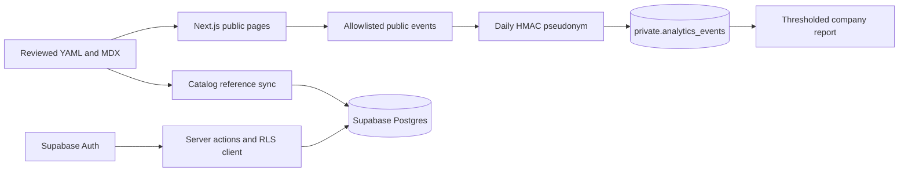

# AI SRE Watchlist implementation status and task ledger

Updated: 2026-07-13

## Implemented

### Application foundation

- Migrated the legacy Vite/JavaScript SPA to Next.js 16 App Router, React 19, and strict TypeScript.
- Added official shadcn/ui Radix Nova components and restored the official neutral theme.
- Removed the public sidebar and legacy UI primitives/CSS.
- Added metadata, JSON-LD, sitemap, robots, RSS, error, loading, and not-found routes.

### Catalog and content

- Strict Zod loaders for 77 AI SRE products, 34 observability products, 18 curated companies, and an 18-product research cohort.
- Six substantive published practitioner resources.
- Draft comparison/blog/update documents remain unpublished until editorial review.
- Catalog reference sync supports Drizzle `DATABASE_URL` mode and a linked Supabase CLI mode; absent refs are deactivated rather than deleted.

### Practitioner product

- Distinct Save product, Follow company, Evaluation candidate, and Company opt-in models.
- Private one-note-per-product autosave.
- Named evaluations with goal, requirements, risks, decision, and ordered candidates.
- Real Bell delivery from reviewed updates; honest empty state and no fake unread count.
- Split-screen Google/GitHub/magic-link sign-in and signed pending intents for Save/Follow.
- Reviewed correction/update submissions with Zod, honeypot, throttling, and no direct publishing.

### Persistence and privacy

- Supabase SSR session handling and user-owned RLS policies.
- Drizzle schema for operator/aggregate access.
- Public catalog stays file-backed; only workflow reference rows are synchronized to Postgres.
- Private analytics accepts only allowlisted public events, including aggregate product-share actions, stores a daily HMAC pseudonym, exposes no analytics table to anon/auth, and suppresses company reports below 10 distinct daily actors. Share events contain only the product subject and never a destination, channel, message, URL, identity, note, or search value.
- Production Supabase migrations and current catalog references were pushed on 2026-07-10.

### Quality system

- Catalog validator, legacy YAML validator, asset audit, and shadcn/UI consistency scanner.
- 54 Vitest tests at the time of this update.
- 20 Playwright workflows across desktop Chromium and 390px WebKit.
- CI jobs for quality/build, browser workflows, and clean Supabase migration replay/lint.

## Runtime architecture

## External production release tasks

These are account configuration, not missing code. Complete them against the confirmed Vercel/Supabase projects only.

1. Link this checkout to the exact Vercel project and verify the dashboard target.
2. Add Vercel production/preview/development variables:
   - `NEXT_PUBLIC_SUPABASE_URL`
   - `NEXT_PUBLIC_SUPABASE_PUBLISHABLE_KEY`
   - `DATABASE_URL` (server-only transaction pooler URL)
   - `AUTH_INTENT_SECRET` (random, at least 32 characters)
   - `ANALYTICS_HASH_SECRET` (different random secret, at least 32 characters)
   - `NEXT_PUBLIC_SITE_URL=https://aisre.pavangudiwada.dev`
   - optional `NEXT_PUBLIC_POSTHOG_KEY`/`NEXT_PUBLIC_POSTHOG_HOST`
3. Add `aisre.pavangudiwada.dev` to the confirmed Vercel project, then create the exact DNS record Vercel supplies.
4. In Supabase Auth URL configuration, set the production Site URL to the canonical domain and add exact `/auth/callback` and `/auth/confirm` redirect paths; retain intentional localhost/preview patterns.
5. Confirm Google and GitHub provider credentials and rotate any credentials previously exposed during development.
6. Configure custom SMTP before inviting users; Supabase's default email allowance is not a production delivery system.
7. Enable leaked-password protection if password login is ever enabled. The current app is passwordless.
8. Deploy a preview, run `npm run test:e2e` against it, then promote the same artifact to production.

## Content/product work after release

Marketing is intentionally ongoing rather than a one-time implementation batch.

### Research Wave 2

- NeuBird: deepen evidence claims and deployment/security sources.
- OpenObserve AI SRE: add a real product record before company mapping.
- Datadog Bits AI SRE and Klaudia by Komodor: establish product-vs-platform scope precisely.
- Ciroos: deepen evidence and screenshots.

Acceptance: each profile has official sources, checked dates, product scope, deployment boundaries, screenshot/logo, and no inferred pricing/outcomes.

### Research Wave 3

- Rootly AI SRE, PagerDuty SRE Agent, Causely, and DrDroid.
- Same evidence acceptance criteria as Wave 2.

### Editorial activation

- Interview at least one practitioner weekly for the first 90 days.
- Publish only substantive comparisons/blogs/updates; never thin programmatic SEO pages.
- Turn reviewed product changes into source-linked update documents, sync them, then notify followers.
- Use the scorecard, incident workflow map, replay guide, and security checklist as founder-led distribution assets.

### Company monetization later

- Start only after practitioner traffic and follows exist.
- Permitted direction: clearly labeled sponsorship, richer reviewed showcase modules, aggregate thresholded interest reports, newsletter/content distribution.
- Forbidden direction: selling practitioner identity, notes, saves, evaluation membership, or small-cohort behavior.

## Definition of done for any future change

1. Domain boundary and public/private classification are explicit.
2. Inputs have Zod validation; data access respects RLS or server-only Drizzle boundaries.
3. UI uses official installed shadcn composition and semantic tokens.
4. Unit/integration tests cover behavior; browser QA covers the full user outcome.
5. `npm run check:release` passes.
6. Relevant source/asset/editorial metadata is updated.
