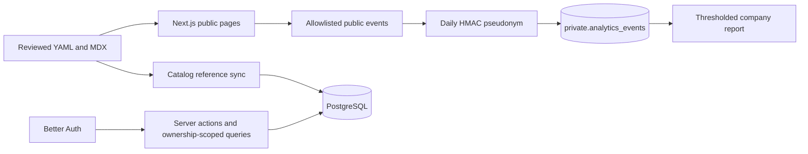

# AI SRE Watchlist implementation status and task ledger

Updated: 2026-09-16

## Implemented

### Application foundation

- Migrated the legacy Vite/JavaScript SPA to Next.js 16 App Router, React 19, and strict TypeScript.
- Added official shadcn/ui Radix Nova components and restored the official neutral theme.
- Removed the public sidebar and legacy UI primitives/CSS.
- Added metadata, JSON-LD, sitemap, robots, RSS, error, loading, and not-found routes.

### Catalog and content

- Strict Zod loaders for 80 AI SRE products, 34 observability products, and
  18 curated companies. Accepted catalog/asset warnings are identity-gated in
  `config/validation-warning-baseline.json`, rather than permitted by a mutable
  numeric budget.
- Six substantive published practitioner resources.
- Draft comparison/blog/update documents remain unpublished until editorial review.
- Catalog reference sync is non-mutating by default. Explicit apply mode deactivates absent refs, upserts current refs, and verifies active company/product slug and product-source-hash parity inside the same transaction.

### Practitioner product

- Distinct Save product, Follow company, Evaluation candidate, and Company opt-in models.
- Private one-note-per-product autosave.
- Named evaluations with goal, requirements, risks, decision, and ordered candidates.
- Real Bell delivery from reviewed updates; honest empty state and no fake unread count.
- Split-screen Google/GitHub/magic-link sign-in and signed pending intents for Save/Follow.
- Reviewed correction/update submissions with Zod, honeypot, throttling, and no direct publishing.

### Persistence and privacy

- Better Auth session handling and server-owned PostgreSQL authorization.
- Drizzle schema for operator/aggregate access.
- Public catalog stays file-backed; only workflow reference rows are synchronized to Postgres.
- Private analytics accepts only allowlisted public events, including aggregate product-share actions, stores a daily HMAC pseudonym, exposes no analytics table to anon/auth, and suppresses company reports below 10 distinct daily actors. Share events contain only the product subject and never a destination, channel, message, URL, identity, note, or search value.
- Historical Supabase migration notes describe an earlier implementation. The
  active runtime uses ordered plain-Postgres migrations under `database/migrations`.

### Quality system

- Catalog validator, legacy YAML validator, asset audit, and shadcn/UI consistency scanner.
- 54 Vitest tests at the time of this update.
- 20 Playwright workflows across desktop Chromium and 390px WebKit.
- CI jobs for quality/build, browser workflows, and a clean PostgreSQL bootstrap.

## Runtime architecture

## External production release tasks

These are deployment configuration, not missing code. Complete them against the
confirmed exe VM and canonical hostname only.

The `authenticated-browser` CI job is the release gate for private workflows. It
starts a loopback PostgreSQL 16 service, applies `database/migrations/`, and
uses Better Auth’s VM-only test harness. Browser code receives only the
one-time test sign-in URL, never database credentials.

1. Configure the exact exe VM and verify the deployed SHA target.
2. Add VM-only environment variables:
   - `DATABASE_URL` (server-only loopback PostgreSQL URL)
   - `TRUST_PROXY=exe` only behind the exe reverse proxy. Without it, analytics
     and editorial rate limiting use a shared fail-closed network bucket.
   - `AUTH_INTENT_SECRET` (random, at least 32 characters)
   - `ANALYTICS_HASH_SECRET` (different random secret, at least 32 characters)
   - `NEXT_PUBLIC_TURNSTILE_SITE_KEY` and `TURNSTILE_SECRET_KEY`
   - `SUBMISSION_HASH_SECRET` (another random secret, at least 32 characters)
   - `NEXT_PUBLIC_SITE_URL=https://aisrewatchlist.com`
   - optional `NEXT_PUBLIC_POSTHOG_KEY`/`NEXT_PUBLIC_POSTHOG_HOST`
3. Point `aisrewatchlist.com` to the confirmed exe VM and verify HTTPS.
4. In Better Auth provider configuration, set the production Site URL and exact callback paths; retain intentional localhost patterns.
5. Confirm Google and GitHub provider credentials and rotate any credentials previously exposed during development.
6. Configure the production SMTP provider before inviting users.
7. Enable leaked-password protection if password login is ever enabled. The current app is passwordless.
8. Configure the GitHub `production` environment with approval protection and VM deploy credentials only.
9. Ensure the VM has the native PostgreSQL `psql` client, apply the migration
   runner to a disposable database, verify backup/restore, then run the
   immutable-SHA VM deployer.

Ordinary pull-request CI never connects to or mutates the VM database. The VM
deployer applies reviewed ordered migrations after backup verification and
before atomic traffic cutover.

## Content/product work after release

Marketing is intentionally ongoing rather than a one-time implementation batch.

### Research Wave 2

- NeuBird: deepen evidence claims and deployment/security sources.
- OpenObserve AI SRE: add a real product record before company mapping.
- Datadog Bits AI SRE and Klaudia by Komodor: establish product-vs-platform scope precisely.
- Ciroos: deepen evidence and screenshots.

Acceptance: each profile has official sources, checked dates, product scope, deployment boundaries, screenshot/logo, and no inferred pricing/outcomes.

### Research Wave 3

- Rootly AI SRE, PagerDuty SRE Agent, Causely, and DrDroid.
- Same evidence acceptance criteria as Wave 2.

### Editorial activation

- Interview at least one practitioner weekly for the first 90 days.
- Publish only substantive comparisons/blogs/updates; never thin programmatic SEO pages.
- Turn reviewed product changes into source-linked update documents, sync them, then notify followers.
- Use the scorecard, incident workflow map, replay guide, and security checklist as founder-led distribution assets.

### Company monetization later

- Start only after practitioner traffic and follows exist.
- Permitted direction: clearly labeled sponsorship, richer reviewed showcase modules, aggregate thresholded interest reports, newsletter/content distribution.
- Forbidden direction: selling practitioner identity, notes, saves, evaluation membership, or small-cohort behavior.

## Definition of done for any future change

1. Domain boundary and public/private classification are explicit.
2. Inputs have Zod validation; data access is ownership-scoped in server-only
   PostgreSQL queries.
3. UI uses official installed shadcn composition and semantic tokens.
4. Unit/integration tests cover behavior; browser QA covers the full user outcome.
5. `npm run check:release` passes.
6. Relevant source/asset/editorial metadata is updated.
